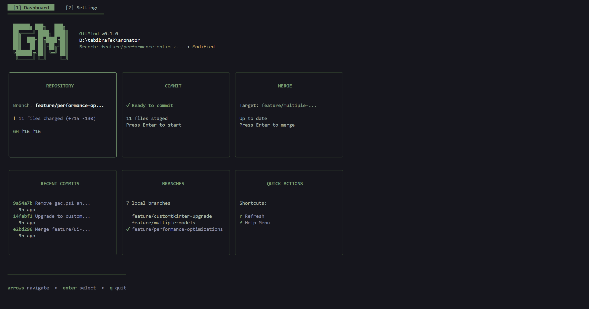
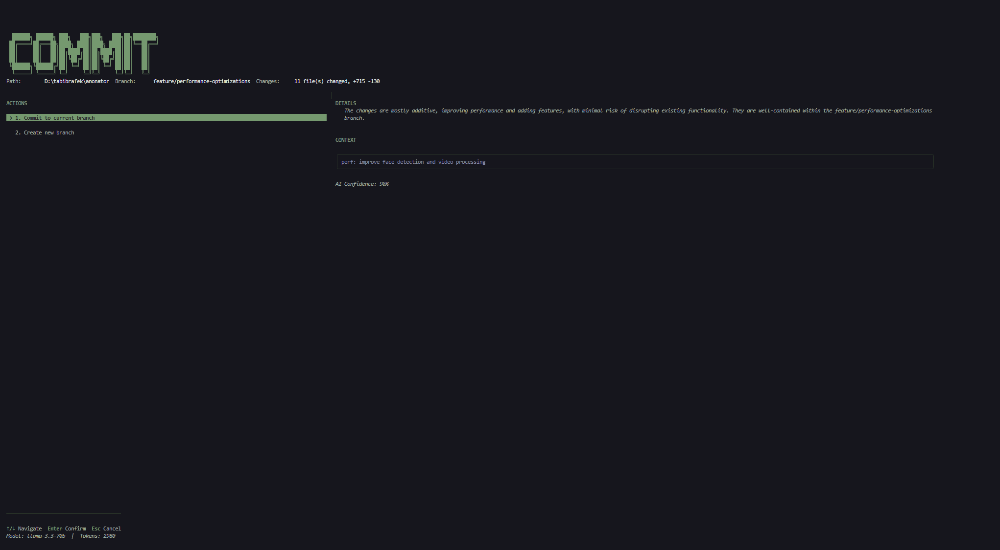
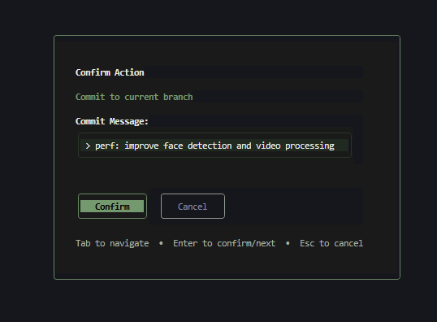
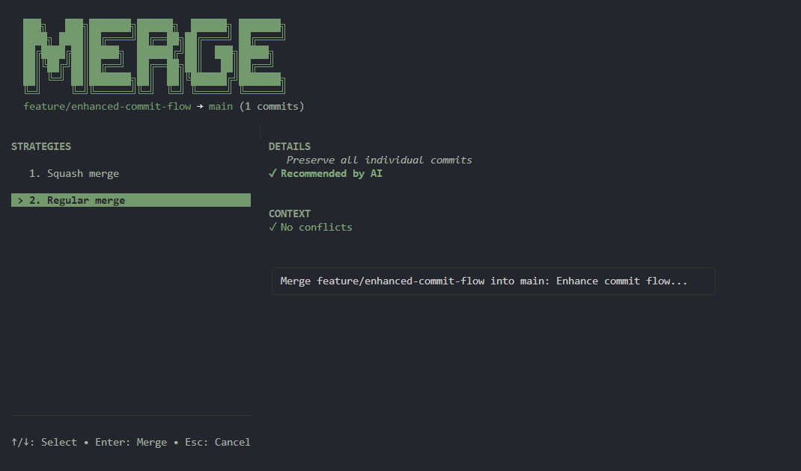
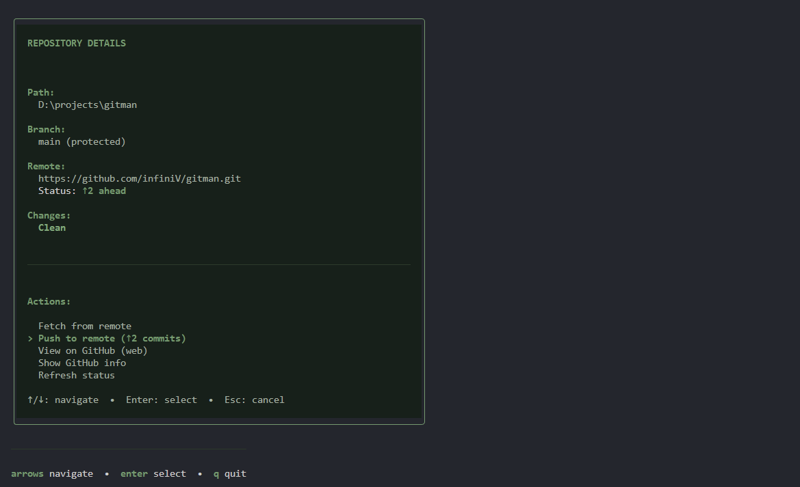

# GitMind (gm)

An AI-powered Git CLI manager that makes complex Git workflows simple through intelligent automation.

<p align="center">
  
</p>

## Features

### Core Features
- **AI-Generated Commit Messages**: Analyzes your changes and generates meaningful, contextual commit messages
  <p align="center"></p>
- **Smart Workflow Decisions**: Interactive TUI helps you decide between direct commits and feature branches
  <p align="center"></p>
- **Intelligent Merge Suggestions**: AI-powered merge strategy recommendations
  <p align="center"></p>
- **Free Tier Friendly**: Optimized for free API tiers with graceful degradation and token reduction

### UI & Configuration
- **Comprehensive Onboarding Wizard**: Step-by-step setup for new workspaces with 8 guided screens
- **Tabbed Dashboard Interface**: Switch between Dashboard and Settings with keyboard shortcuts
- **GitHub Integration**: Create repositories directly from the CLI with full customization
  <p align="center"></p>
- **Flexible Configuration**: Commit conventions, branch naming patterns, protected branches, and more
- **Live Settings Editor**: Nested tabs for Git, GitHub, Commits, Naming, and AI settings

### Technical Excellence
- **Production Ready**: Clean architecture, comprehensive tests, and robust error handling
- **Windows Support**: Fully tested on Windows with compiled binary ready to use
- **Cross-Platform**: Works on Windows, macOS, and Linux

## 🚀 Quick Start

**See [QUICKSTART.md](QUICKSTART.md) for detailed setup instructions!**

### TL;DR

1. **Get a free Cerebras API key**: https://cloud.cerebras.ai/
2. **Build the binary**:
   ```bash
   go build -o bin/gm.exe ./cmd/gm
   # Or use the build script: scripts\build.bat
   ```
3. **Run onboarding wizard** (first time setup):
   ```bash
   bin\gm.exe onboard
   # Or just run any command - wizard starts automatically in new workspaces
   bin\gm.exe commit
   ```
4. **Use the dashboard**:
   ```bash
   bin\gm.exe
   # Press 1 for Dashboard, 2 for Settings
   # Navigate with arrow keys, Enter to select
   ```

## 🎨 UI Features

### Onboarding Wizard
The comprehensive 8-step onboarding wizard guides you through:
1. **Welcome**: Overview of GitMind features
2. **Git Setup**: Initialize git repository if needed
3. **GitHub Integration**: Create GitHub repository with full options (visibility, license, .gitignore, etc.)
4. **Branch Configuration**: Main branch, protected branches, auto-push/pull
5. **Commit Conventions**: Conventional Commits, custom templates, or freeform
6. **Branch Naming**: Patterns and allowed prefixes
7. **AI Configuration**: Provider, API key, tier, models, context settings
8. **Summary**: Review and save configuration

### Tabbed Interface
- **Tab 1 - Dashboard**: 6-card grid showing repository status, recent commits, branches, and quick actions
- **Tab 2 - Settings**: 5 nested tabs for comprehensive configuration
  - **Git**: Main branch, protected branches, auto-push/pull
  - **GitHub**: Integration settings, default visibility, license, .gitignore
  - **Commits**: Convention type, allowed types, scope/breaking requirements
  - **Naming**: Branch patterns, allowed prefixes, enforcement
  - **AI**: Provider, API key, tier, models, diff size limits

### Keyboard Navigation
- `1` / `2`: Switch between Dashboard and Settings tabs
- `Ctrl+Tab`: Cycle through main tabs
- `1-5`: Switch between Settings nested tabs (when in Settings)
- `Tab` / `↑↓`: Navigate fields within forms
- `Enter` / `Space`: Select/toggle options
- `S`: Save settings
- `Esc` / `Q`: Return to dashboard or quit

## 📦 Installation

### Option 1: Build from Source (Current)
```bash
git clone <this-repo>
cd gitman
go build -o gm.exe ./cmd/gm
```

### Option 2: Download Release (Coming Soon)
Pre-built binaries will be available in GitHub Releases.

### Option 3: Package Managers (Future)
```bash
# Scoop (planned)
scoop bucket add gitman https://github.com/yourusername/scoop-gitman
scoop install gitman

# Chocolatey (planned)
choco install gitman
```

## Architecture

Built with Clean Architecture and Domain-Driven Design principles:

- **Domain Layer**: Core business logic (commits, repositories, decisions)
- **Use Case Layer**: Application workflows (analyze, commit, configure)
- **Adapter Layer**: External integrations (Git, AI providers, config)
- **UI Layer**: Bubble Tea TUI components

## Development

### Prerequisites
- Go 1.21+
- Git 2.30+

### Build
```bash
go build -o gm ./cmd/gm
```

### Test
```bash
go test -v ./...
go test -coverprofile=coverage.out ./...
```

### Project Structure
```
gitman/
├── cmd/gm/              # CLI entry point
├── internal/
│   ├── domain/          # Business entities
│   ├── usecase/         # Application logic
│   ├── adapter/         # External services
│   └── ui/              # TUI components
├── test/                # Integration tests
└── configs/             # Configuration templates
```

## License

MIT License - see LICENSE file for details

## Contributing

Contributions welcome! Please read CONTRIBUTING.md first.
